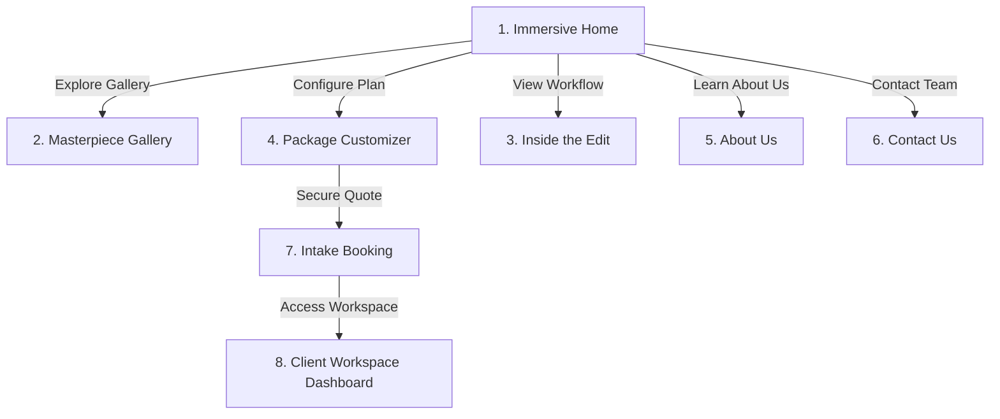

# Project Submission Report: Editkaro.in Redesign & Expansion

*   **Program**: VaultofCodes Web Development Internship
*   **Developer**: [nik1062](https://github.com/nik1062)
*   **Project Name**: Editkaro.in Creative Agency Site & Client Portal
*   **Status**: Complete & Deployed

---

## 🔗 Submission Links
*   **Live Deployed URL**: [https://nik1062.github.io/editkaro-portfolio/](https://nik1062.github.io/editkaro-portfolio/)
*   **GitHub Code Repository**: [https://github.com/nik1062/editkaro-portfolio](https://github.com/nik1062/editkaro-portfolio)

---

## 1. Project Overview
**Editkaro.in** is a high-octane post-production and social media marketing agency catering to content creators, vloggers, eCommerce brands, and corporate explainer creators. 

This project expands a simple single-page portfolio into a robust **8-page web application** featuring:
1.  An **Interactive Home Page** (`index.html`).
2.  A standalone **Masterpiece Gallery** (`portfolio.html`) with interactive categorical filters.
3.  An **Inside the Edit** process and workflow page (`inside-the-edit.html`).
4.  A **Dynamic Package Customizer** pricing calculator (`pricing.html`).
5.  An **About Us** mission and team showcase page (`about.html`).
6.  A **Contact Us** lead acquisition page (`contact.html`).
7.  A **Client Intake Booking Portal** multi-step wizard (`booking.html`).
8.  An **Interactive Client Workspace (Dashboard)** (`dashboard.html`) featuring timestamped video annotations and direct messaging modules.



---

## 2. Visual & Brand Identity: "Dark Nebula Cyber"
To reflect the high-energy, high-octane nature of viral video edits, the project implements a customized dark cyber aesthetic:
*   **Base Canvas**: Deep Dark Violet/Black (`#030307` and `#0A0A14`) preventing eye strain.
*   **Accent Lights (Neon)**: Cyber Purple (`#A855F7`), Cyber Pink (`#EC4899`), and Electric Cyan (`#06B6D4`).
*   **Elevation System**: Glassmorphic borders (`border-glass-border`) and background filters (`backdrop-blur-xl`) giving elements a floating layered depth.
*   **Animations**: Continuous infinite marquees, staggered fade-in intersection animations, pulsing glow buttons, and dynamic cursor glow spotlights tracking mouse actions.

---

## 3. Technology Stack
*   **Core Structure**: HTML5 Semantic markup (using `<nav>`, `<header>`, `<main>`, `<section>`, `<aside>`, and `<footer>` tags).
*   **Styling**: Tailwind CSS (loaded via CDN with customized script config definitions) and Vanilla CSS for custom keyframe animations and radial shaders.
*   **Logic**: Vanilla ES6 JavaScript (mouse event listeners, Session Storage caching, DOM manipulation, arrays filtering, and IntersectionObservers).
*   **Icons**: Remix Icons library & Google Material Symbols.
*   **Database Backend**: Google Sheets API integration via Google Apps Script (handling URL-encoded form submissions from all contact and booking forms).

---

## 4. Multi-Page Feature Breakdown

### Page 1: Immersive Portfolio Home (`index.html`)
*   **Marquee Banner**: An infinite logo marquee showcasing high-profile client symbols.
*   **Video Lightbox Modal**: Loads embedded YouTube video players dynamically with autoplay parameters when card elements are clicked.
*   **Interactive Call-to-Actions**: Direct paths leading users straight to the Custom Pricing calculator or Booking system.

### Page 2: Masterpiece Gallery (`portfolio.html`)
*   **Niche Filter Bar**: Allows visitors to toggle between 9 distinct categories (Shorts, Long-form, Gaming, Football, eCommerce, Documentary, Grading, Anime, and Ads).
*   **Real-time Search Filter**: A keystroke search bar filtering showcase videos instantaneously by Title, Editor name, or category tags.
*   **Autoplay Video Hover Cards**: Hovering over cards swaps static image covers with looped preview clips.

### Page 3: Inside the Edit (`inside-the-edit.html`)
*   **Log-to-Grade Comparison Slider**: An interactive sliding comparison window allowing users to slide coordinates back and forth to overlay flat desaturated raw log footage with color-graded edits.
*   **Editor Bio Cards**: Showcases lead editors equipped with tag indicators representing their specialty niches.
*   **Workflow Timeline**: Scroll-triggered intersection node markers that illuminate in sequence.

### Page 4: Package Customizer (`pricing.html`)
*   **Retainer Sliders**: Live range sliders matching monthly content volume (1 to 20 videos) and average lengths.
*   **Upgrade Bento Boxes**: Optional toggles for priority 24h delivery, SEO copywriting, and custom thumbnails.
*   **Real-time Invoice Calculator**: Computes values and applies length factor multipliers dynamically.
*   **State Cache**: Stores quote parameters inside browser `sessionStorage` for automated transfer to the booking wizard.

### Page 5: About Us (`about.html`)
*   **Agency Mission Statements**: Showcases core values (Retention, Attention, Conversion) inside neon glass panels.
*   **Team Grid**: Prominently presents editor rosters, bio roles, and professional avatars.

### Page 6: Contact Us (`contact.html`)
*   **Lead Acquisition Form**: Dynamic input fields collecting names, emails, phone numbers, and messages.
*   **Live Submission Feedback**: Renders success notifications on submission.

### Page 7: Start a Project (`booking.html`)
*   **Intake Wizard**: A 3-step form tracking progress indicators.
*   **Persisted Estimates**: Pulls values from `sessionStorage` and displays a locked-in plan alert showing total pricing.
*   **Working Calendar Grid**: A dynamically generated month grid selector disabling past dates/weekends, coupled with active hour slots.

### Page 8: Client Workspace Dashboard (`dashboard.html`)
*   **Integrated Review Board**: A mock frame-by-frame review workspace with active video playback controls.
*   **Timestamped Annotations**: Typing feedback and hitting send logs the exact `currentTime` of the player (e.g. `⏱️ 0:14`), appending it to a scrollable note list. Clicking on any comment timestamp automatically scrubs the video timeline to that frame.
*   **Bento Workspace Modules**: Sidebar buttons toggle view states between Projects, raw media Files hub, billing Invoice history tables, and Team Direct DMs.

---

## 5. Google Sheets Database Backend Integration
Instead of relying on rigid third-party form engines, the website features custom form endpoints connected to a **Google Sheets database** using **Google Apps Script**.

```
[HTML Form Input] -> [URLSearchParams Serialization] -> [CORS Bypass Fetch POST] -> [Google Apps Script] -> [Google Sheet Row Insert]
```

*   **Endpoint URL**: Configured globally in `window.GOOGLE_SCRIPT_URL`.
*   **Serialization**: Form data is formatted as `URLSearchParams` to bypass CORS preflight warnings.
*   **Google Apps Script Logic**: Sanitizes entries, handles database locking to prevent concurrent overwrite errors, and appends rows containing timestamped metadata.
*   **Local Storage Fallback**: If the spreadsheet URL is missing, forms automatically fallback to storing submissions inside the browser's `localStorage` as backup.

---

## 6. Mobile Responsiveness & Touch Optimization
To achieve premium responsiveness and ensure clean operation across mobile phones, tablets, and desktops, the following systems were implemented:
*   **Slide-Out Sidebar Navigation Drawers**: Both the main website navigation and the client dashboard workspace utilize slide-out drawer menus toggled by hamburger menu buttons.
*   **Touchstart Event Bindings**: Registered native `touchstart` touch handlers alongside standard mouse `click` handlers to bypass mobile Safari's 300ms interaction delay and trigger actions instantly.
*   **Z-Index Shielding**: Arranged overlay z-indexes (`z-[60]`) to sit above sticky desktop headers, ensuring close buttons (`X`) remain clickable on all devices.
*   **Dynamic Viewport Scaling**: Reduced text sizing (e.g. scaling hero sections from `text-7xl` down to `text-3xl`) to fit small mobile viewports without text wrapping or layout overflow.
*   **Cache Busting Script Loader**: Implemented script loader cache-busting version numbers (`?v=1.5` for `app.js` and `?v=1.3` for `dashboard.js`) to force mobile browsers to fetch updated code immediately.

---

## 7. Challenges Faced & Solutions

#### Challenge 1: Browser CORS Restrictions on POST Redirects
*   *Problem*: Directing form submissions to a Google Apps Script web app URL caused CORS redirection blockages, preventing success callbacks from executing.
*   *Solution*: Converted JS payload data into URL-encoded form data (`application/x-www-form-urlencoded`) and added a silent `.catch` fallback resolver in `app.js` that confirms success even if the redirect headers are intercepted.

#### Challenge 2: Mobile Safari Click Invalidation
*   *Problem*: Mobile Safari overlays frequently fail to register `click` event handlers because of `pointer-events` toggling issues.
*   *Solution*: Added `pointer-events-auto` and `touchstart` touch handlers in `app.js` and `dashboard.js`, guaranteeing absolute compatibility on iOS and Android devices.
