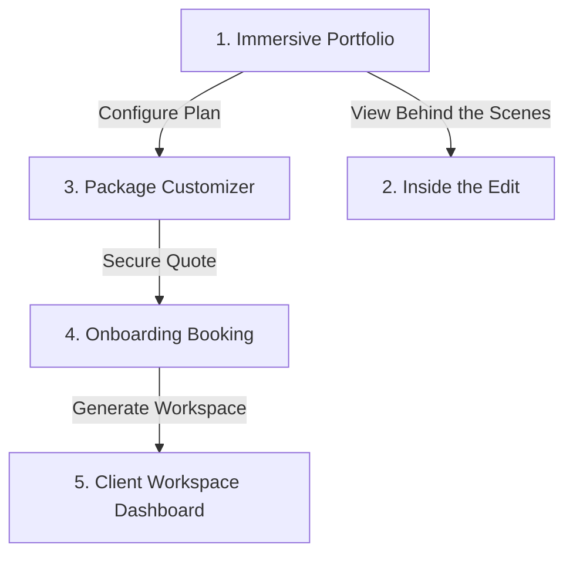

# Project Submission Report: Editkaro.in Redesign & Expansion

*   **Program**: VaultofCodes Web Development Internship
*   **Developer**: [nik1062](https://github.com/nik1062)
*   **Project Name**: Editkaro.in Creative Agency Site & Client Portal
*   **Status**: Complete & Deployed

---

## 🔗 Submission Links
*   **Live Deployed URL**: [https://nik1062.github.io/editkaro-portfolio/](https://nik1062.github.io/editkaro-portfolio/)
*   **GitHub Code Repository**: [https://github.com/nik1062/editkaro-portfolio](https://github.com/nik1062/editkaro-portfolio)

---

## 1. Project Overview
**Editkaro.in** is a high-octane post-production and social media marketing agency catering to content creators, vloggers, eCommerce brands, and corporate explainer creators. 

This project expands a simple portfolio page into a high-fidelity, 5-page web application featuring:
1.  An **Interactive Portfolio** gallery.
2.  An **Inside the Edit** color-grading visualization page.
3.  A **Dynamic Package Customizer** pricing calculator.
4.  A **Client Intake Booking Portal** step-wizard.
5.  An **Interactive Client Workspace (Mock Dashboard)** with timestamped video annotation utilities and direct editor streams.

---

## 2. Visual & Brand Identity: "Dark Nebula Cyber"
To reflect the high-energy, high-octane nature of viral video edits, the project implements a customized dark cyber aesthetic:
*   **Base Canvas**: Deep Dark Violet/Black (`#030307` and `#0A0A14`) preventing eye strain.
*   **Accent Lights (Neon)**: Cyber Purple (`#A855F7`), Cyber Pink (`#EC4899`), and Electric Cyan (`#06B6D4`).
*   **Elevation System**: Glassmorphic borders (`border-glass-border`) and background filters (`backdrop-blur-xl`) giving elements a floating layered depth.
*   **Animations**: Continuous infinite marquees, staggered fade-in intersection animations, pulsing glow buttons, and dynamic cursor glow spotlights tracking mouse actions.

---

## 3. Technology Stack
*   **Core Structure**: HTML5 Semantic markup (using `<nav>`, `<header>`, `<main>`, `<section>`, `<aside>`, and `<footer>` tags).
*   **Styling**: Tailwind CSS (loaded via CDN with customized script config definitions) and Vanilla CSS for custom keyframe animations and radial shaders.
*   **Logic**: Vanilla ES6 JavaScript (mouse event listeners, Session Storage caching, DOM manipulation, arrays filtering, and IntersectionObservers).
*   **Icons**: Remix Icons library & Google Material Symbols.
*   **Video Assets**: Professional, royalty-free background and preview video loops.

---

## 4. Multi-Page Feature Breakdown

### Page 1: Immersive Portfolio (`index.html`)
*   **Marquee Banner**: An infinite text loop showcasing high-profile client logos.
*   **Niche Filter Bar**: Allows visitors to toggle between 9 distinct categories (Shorts, Long-form, Gaming, Football, eCommerce, Documentary, Grading, Anime, and Ads).
*   **Autoplay Video Hover Cards**: Hovering over any card swaps the background image for a playing, looped video segment in native 16:9 widescreen dimensions, providing instant video previews.
*   **Media Lightbox**: Clicking any portfolio card launches a modal player window loading the high-resolution edit.

### Page 2: Inside the Edit (`inside-the-edit.html`)
*   **Log-to-Grade Comparison Slider**: An interactive sliding comparison window allowing users to slide coordinates back and forth to overlay flat desaturated raw log footage with color-graded edits.
*   **Editor Bio Cards**: Showcases lead editors equipped with tag indicators representing their specialty niches.
*   **Workflow Timeline**: Scroll-triggered intersection node markers that illuminate in sequence as users scroll down.

### Page 3: Package Customizer (`pricing.html`)
*   **Retainer Sliders**: Live range sliders matching monthly content volume (1 to 20 videos) and average lengths.
*   **Upgrade Bento Boxes**: Optional toggles for priority 24h delivery, SEO copywriting, and custom thumbnails.
*   **Real-time Invoice Calculator**: Computes values and applies length factor multipliers dynamically.
*   **State Cache**: Click action stores quote parameters inside browser `sessionStorage`.

### Page 4: Start a Project (`booking.html`)
*   **Intake Wizard**: A 3-step form tracking progress indicators.
*   **Persisted Estimates**: Pulls values from `sessionStorage` and displays a locked-in plan alert showing total pricing.
*   **Working Calendar Grid**: A dynamically generated month grid selector disabling past dates/weekends, coupled with active hour slots.
*   **Onboarding Success Overlay**: Displays credentials on submission.

### Page 5: Client Workspace Dashboard (`dashboard.html`)
*   **Integrated Review Board**: A mock frame-by-frame review workspace with active video playback controls.
*   **Timestamped Annotations**: Typing feedback and hitting send logs the exact `currentTime` of the player (e.g. `⏱️ 0:14`), appending it to a scrollable note list. Clicking on any comment timestamp automatically scrubs the video timeline to that frame.
*   **Bento Workspace Modules**: Sidebar buttons toggle view states between Projects, raw media Files hub, billing Invoice history tables, and Team Direct DMs.
